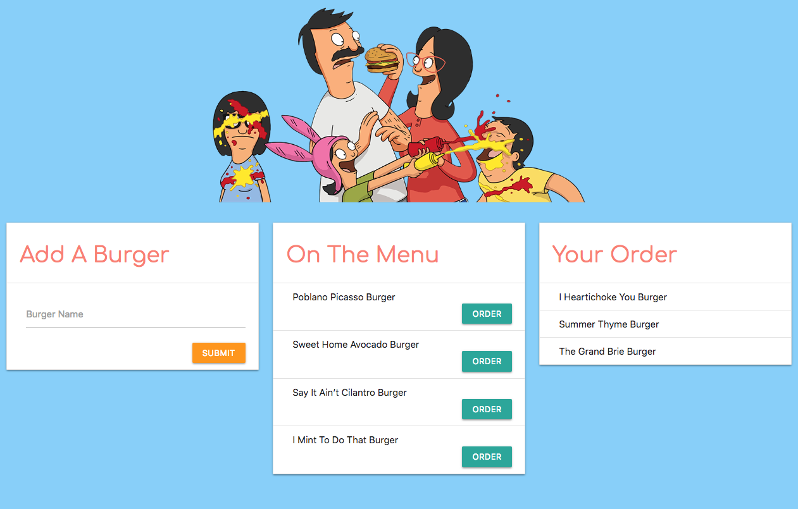

# Burgers, Burgers, Burgers!

### About This Project
This project uses Node, Express, Handlebars, MySQL, and a homemade ORM to create a burger ordering game. Users can input the names of burgers they'd like to eat and the app will display the burger on the "On The Menu" card. Then, users can select which burgers they'd like to order and the app will move the burger to the "Your Order" card. Each burger is stored in the MySQL database, whether it is ordered or not.

### To Play The Game
Go to [this page]() and add a burger to begin!

